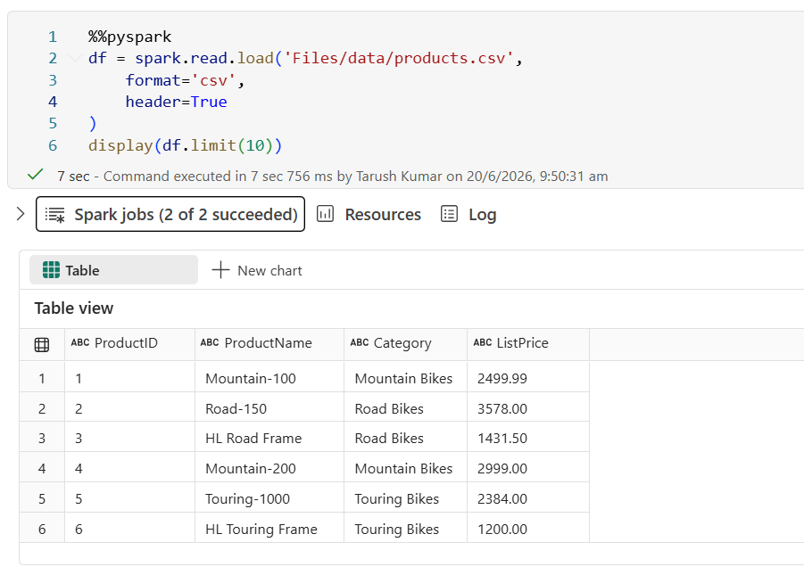
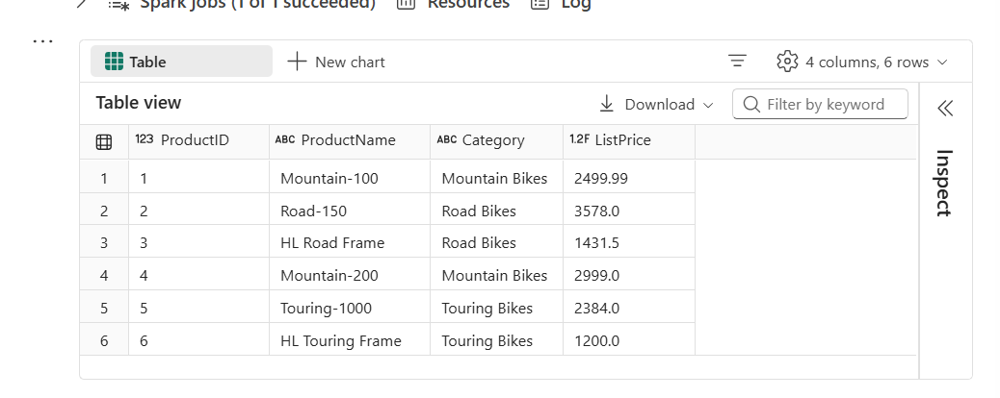
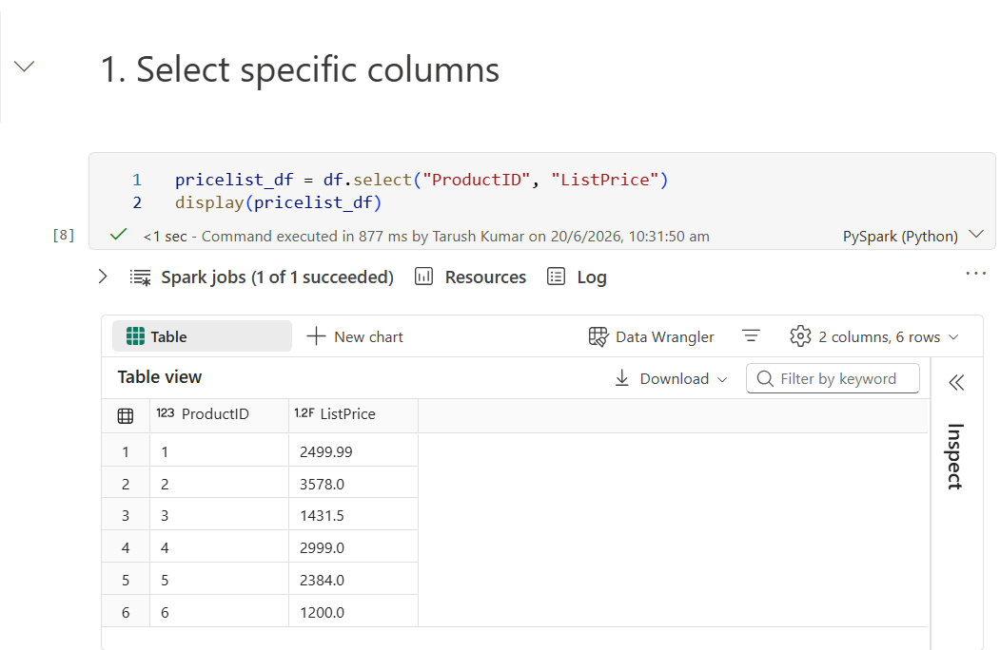
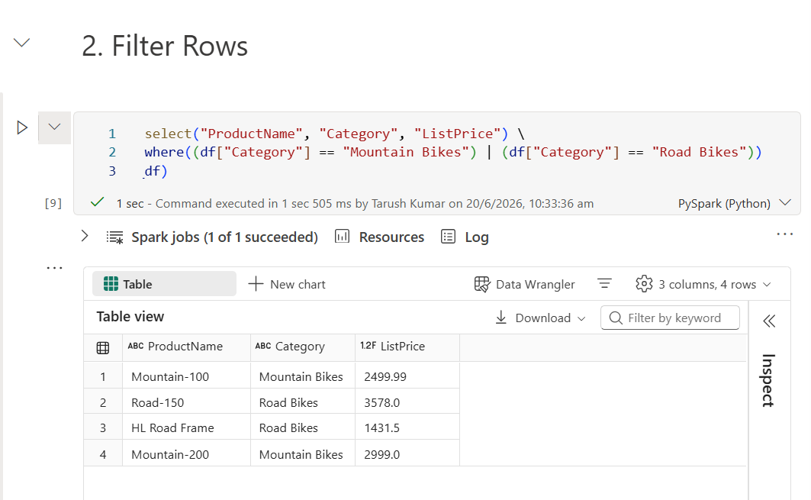
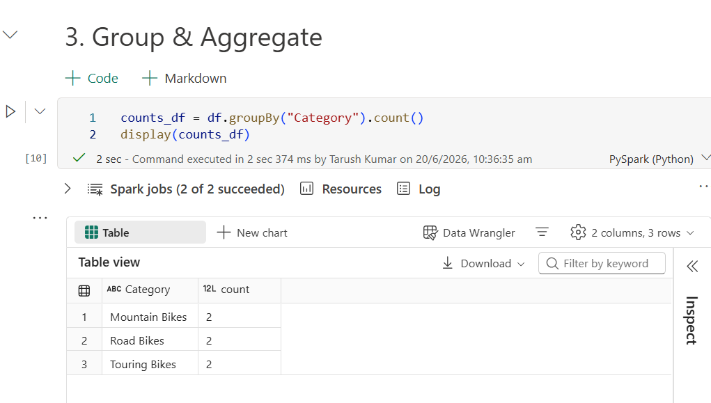
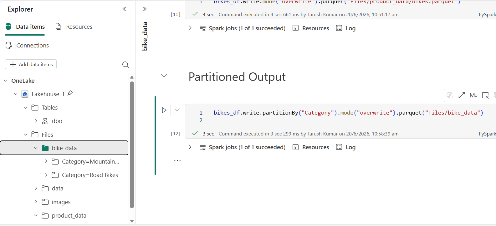
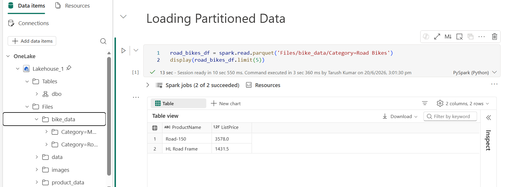

# Demo: Working with Spark DataFrames

Before getting started with the demos make sure to connect your notebook to a lakehouse and upload the sample `CSVs` :
- [products.csv](./data/products.csv) → with header.
- [product-data.csv](./data/product-data.csv) → without header.

**Important**
- To connect Notebook to Lakehouse [👉 see here](../resources.md#how-to-attach-notebook-to-lakehouse-in-fabric)  
- To upload a file in Lakehouse [👉 check out](../resources.md#how-to-upload-a-file-to-lakehouse)
---

## Load CSV with Inferred Schema  
- Load CSV files directly into a DataFrame.
- Spark can **infer schema** from headers and data types.
- [products.csv](./data/products.csv) → use `header=True` and let Spark infer schema.

Example (PySpark):
  ```python
  df = spark.read.load("Files/data/products.csv", format="csv", header=True)
  display(df.limit(10))
  ```



The `%%pyspark` line at the beginning is called a **magic**, and tells Spark that the language used in this cell is PySpark. You can select the language you want to use as a default in the toolbar of the Notebook interface, and then use a magic to override that choice for a specific cell.

---

## Load CSV with Explicit Schema

In the previous example, the first row of the [CSV file](./data/products.csv) contained the `column names`, and Spark was able to infer the data type of each column from the data it contains. 

You can also specify an explicit schema for the data, which is useful when the column names aren't included in the data file, like this [CSV example](./data/product-data.csv)

Example:
```python
from pyspark.sql.types import *
productSchema = StructType([
    StructField("ProductID", IntegerType()),
    StructField("ProductName", StringType()),
    StructField("Category", StringType()),
    StructField("ListPrice", FloatType())
])
df = spark.read.load("Files/data/product-data.csv", format="csv", schema=productSchema, header=False)
display(df.limit(10))
```



---

Complete file 👉 [SparkDataframe](./notebooks/SparkDataframe.ipynb)

---

## Transformations

### 1. Select Specific Columns

For example, the following code example uses the select method to retrieve the `ProductID` and `ListPrice` columns from the `df` dataframe containing product data in the previous example:
```python
pricelist_df = df.select("ProductID", "ListPrice")
```



### 2. Filtering

You can "chain" methods together to perform a series of manipulations that results in a transformed dataframe. For example, this example code chains the `select` and `where` methods to create a new dataframe containing the `ProductName` and `ListPrice` columns for products with a category of `Mountain Bikes` or `Road Bikes`:

```python
bikes_df = df.select("ProductName", "Category", "ListPrice") \
             .where((df["Category"] == "Mountain Bikes") | (df["Category"] == "Road Bikes"))
display(bikes_df)
```



### 3. Group and Aggregate

To group and aggregate data, you can use the `groupBy()` method and aggregate functions(e.g. `count()`). For example, the following PySpark code counts the number of products for each category:

```python
counts_df = df.groupBy("Category").count()
display(counts_df)
```



---

## Saving Data
Save transformed DataFrames to Parquet (preferred format).

```python
bikes_df.write.mode("overwrite").parquet("Files/product_data/bikes.parquet")
```


### Partition output for performance:

To save a dataframe as a partitioned set of files, use the `partitionBy()` method when writing the data. The following example saves the bikes_df dataframe (which contains the product data for the mountain bikes and road bikes categories), and partitions the data by category:

```python
bikes_df.write.partitionBy("Category").mode("overwrite").parquet("Files/bike_data")
```

The folder names generated when partitioning a dataframe include the partitioning column name and value in a column=value format, so the code example creates a folder named bike_data that contains the following subfolders:
- Category=Mountain Bikes
- Category=Road Bikes




Each subfolder contains one or more parquet files with the product data for the appropriate category.

---

## Loading Partitioned Data
Load specific partitions:
```python
road_bikes_df = spark.read.parquet("Files/bike_data/Category=Road Bikes")
display(road_bikes_df.limit(5))
```  
The partitioning columns specified in the file path are omitted in the resulting dataframe. The results produced by the example query would not include a Category column - the category for all rows would be Road Bikes.  
  

**What’s Happening**  
When you save a DataFrame with partitionBy("Category"), Spark writes the data into separate folders for each category.  
Example folder structure:  
```text
Files/bike_data/Category=Mountain Bikes/...
Files/bike_data/Category=Road Bikes/...
Files/bike_data/Category=Touring Bikes/...
```

Each folder contains only the rows for that category.  
The partition column itself (Category) is not stored inside the Parquet files — it’s encoded in the folder path.  

**Why the Column Disappears**  
When you load data from a specific partition path, e.g.:  
```python
road_bikes_df = spark.read.parquet("Files/bike_data/Category=Road Bikes")
```
Spark reads only the files inside the `Category=Road` Bikes folder.  
Since the partition column is already implied by the folder name, Spark doesn’t include a `Category` column in the resulting DataFrame.  
All rows are understood to belong to that partition, so the value is constant (`Road Bikes`) but not explicitly present.

**How to Keep the Column**  
If you want the Category column included in the DataFrame:  
- Load the entire partitioned folder instead of a single partition:
```python
df = spark.read.parquet("Files/bike_data")
```
- Spark will reconstruct the Category column from the folder names.
- Then you can filter rows normally:
```python
road_bikes_df = df.where(df["Category"] == "Road Bikes")
```