# 📊 Fabric Data Engineer Notebook: Sales Order Exploration

This [notebook](./notebooks/Sales_Analytics.ipynb) shows how to use a Microsoft Fabric notebook. We create a sample data file and read it into our lakehouse.

---

## 🚀 Steps Carried Out

### Step 1: Attach the Lakehouse
We opened a new notebook. We used the **Add data items** button to connect our notebook to `Lakehouse_1`.  
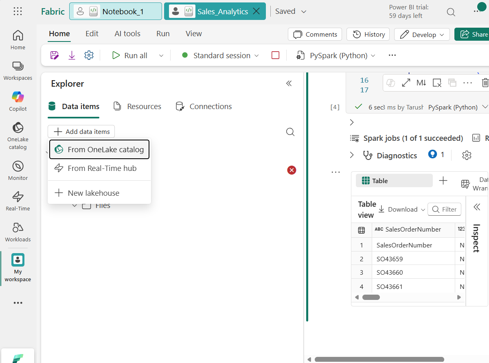  

Learn ways to attach `lakehouse` to `notebook` over here 👉 [Click](../resources.md#how-to-attach-notebook-to-lakehouse-in-fabric)

### Step 2: Create Sample Data
We ran a Python script to build a mock dataset. The script creates a new folder named `orders` and saves a file called `2019.csv` inside it.
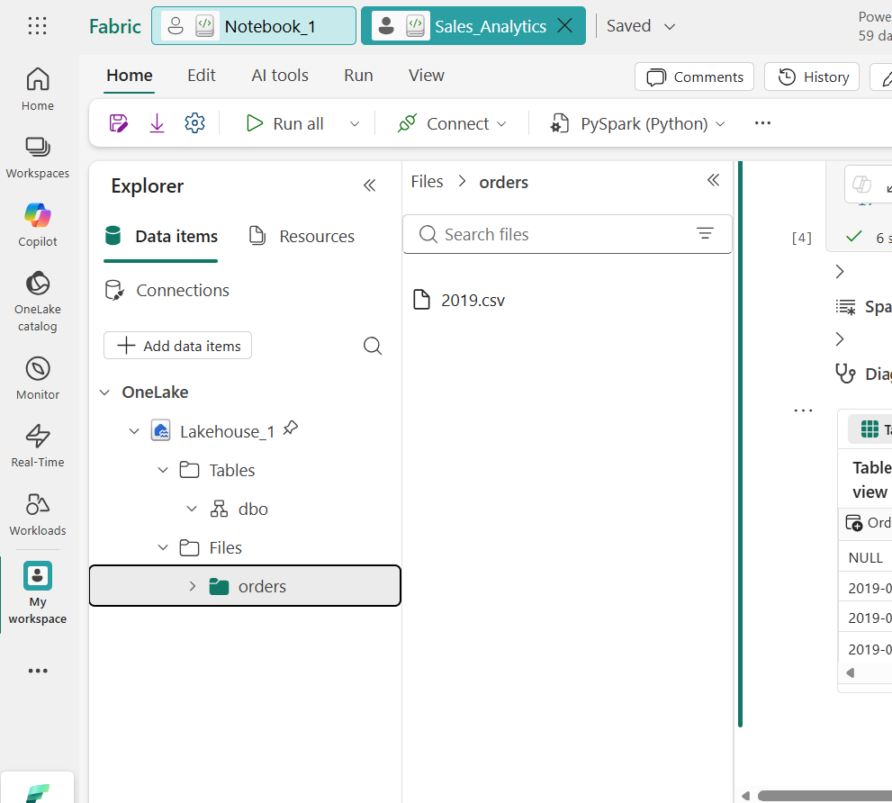

> 📌 **Important:** After running the data generator, you must refresh the files panel. Hover over the **Files** folder on the left, click the three dots `...`, and select **Refresh** to see the new `orders` folder and `2019.csv` file.

### Step 3: Read and Display Data
We used PySpark to load the CSV file. We set up a custom data structure (schema) to make sure our columns had the right types. Finally, we displayed the data as a clean table.
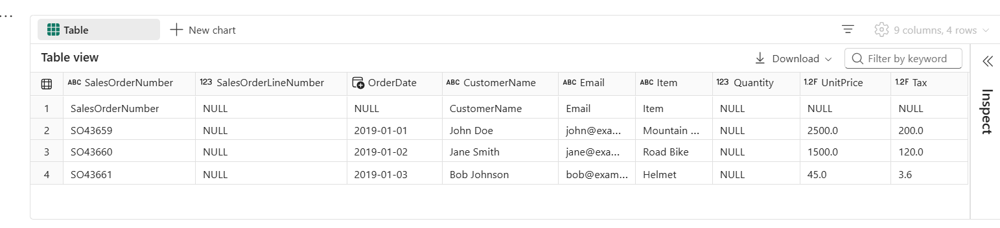

---

## 💻 Code and Syntax Explained

Here is how the code works in simple terms.

### 1. Generating the CSV File
We used **Pandas** (a Python data tool) to make our sample file:
* `data = {...}`: This creates a dictionary of rows and columns for our spreadsheet.
* `pd.DataFrame(data)`: This turns our dictionary into a structured table.
* `os.makedirs(...)`: This creates the `orders` folder in the lakehouse if it is missing.
* `df_sample.to_csv(...)`: This saves our table as a CSV file in the lakehouse.

### 2. Reading the CSV with PySpark
We used **PySpark** (Fabric's big data engine) to read our file:
* `StructType` and `StructField`: These define our **Schema**. They tell Spark what each column is named and what kind of data it holds (like text, numbers, or dates).
* `spark.read.format("csv")`: This tells Spark to look for a CSV file.
* `.schema(orderSchema)`: This applies our custom data structure to the file.
* `.load(...)`: This points Spark to the exact location of our `2019.csv` file.
* `display(df)`: This prints our data onto the screen as a neat, interactive table.

---

# ⚙️ Spark Job Definition (Automated ETL) : Sales Transform  

We automated our data transformation pipeline by migrating our PySpark development code from an interactive notebook into a structured, scheduled **Spark Job Definition** inside Microsoft Fabric.

Below is the visual step-by-step documentation mapping out the configuration, deployment, and live tracking interfaces.

---

## 🚀 Step-by-Step Implementation

### 1. Configuration & Main Script Setup
In your Microsoft Fabric workspace, select **New Spark Job Definition** and set the name to `Sales_Transform`. In the configuration panel, choose **PySpark (Python)** as the language environment and upload [transform.py](./scripts/transform.py) as your main definition file. 

If your script depends on isolated custom utilities or helpers, attach your `utils.py` module within the **Reference file** upload section.

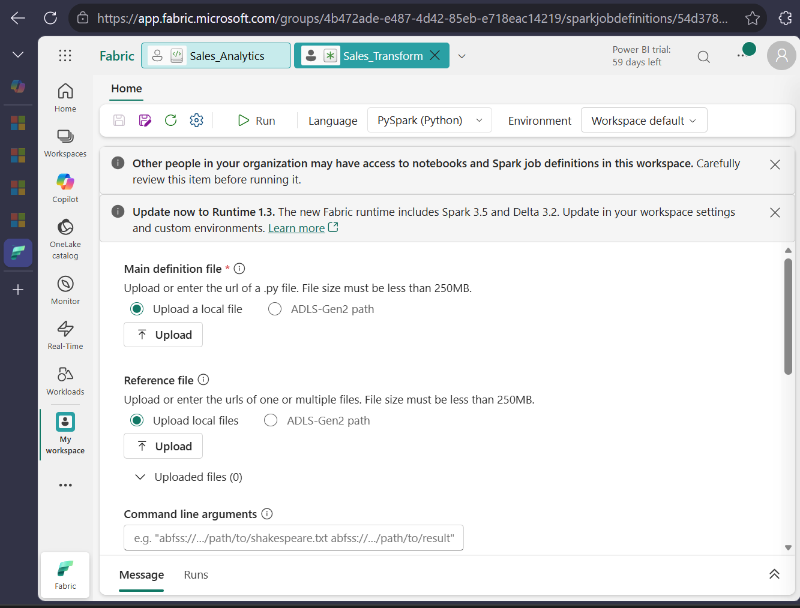

### 2. Connect Storage via Lakehouse Reference
To enable your script to resolve local relative paths (such as reading from `Files/orders/`), associate the job context with your workspace storage assets. Click the **+ Add** button under the Lakehouse Reference card.

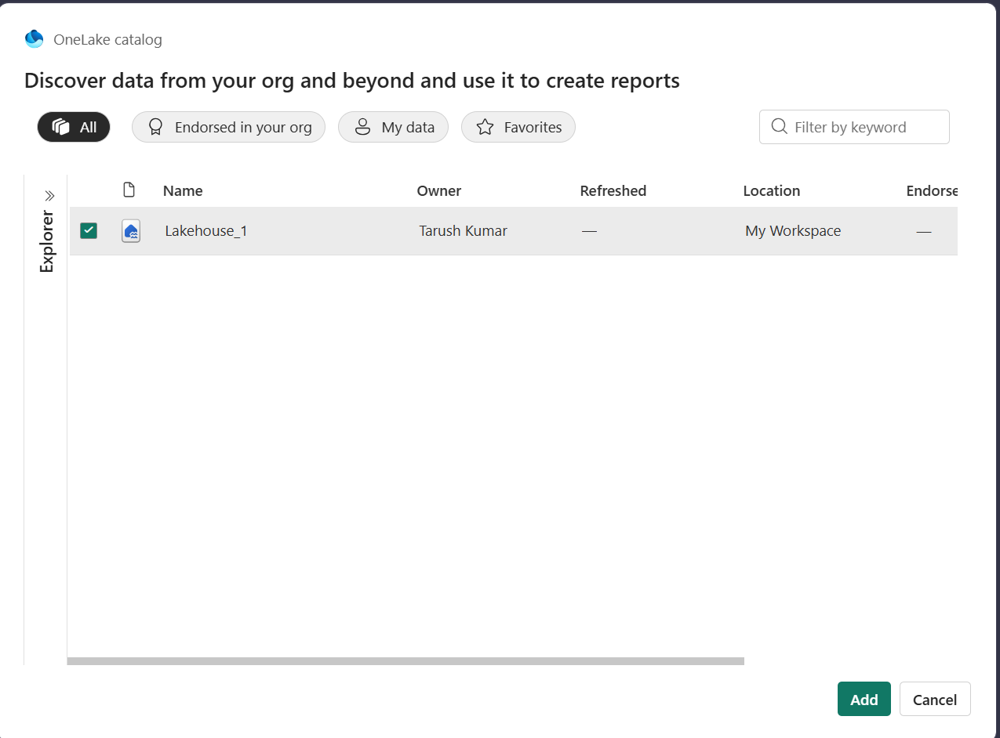

Locate and tick the checkbox for `Lakehouse_1` inside the OneLake catalog modal and add it. Once added, verify it appears as a pinned resource inside your layout to confirm the default storage workspace is successfully established.

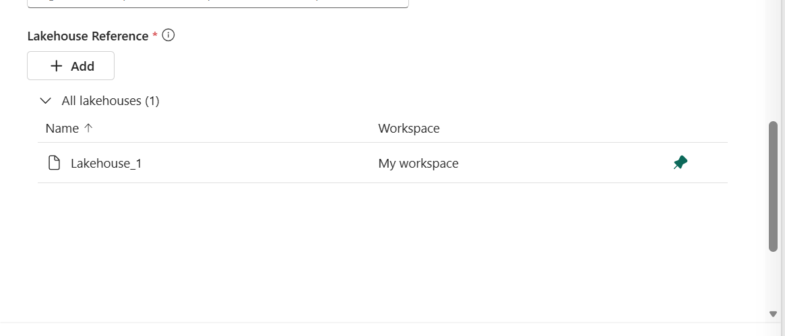

### 3. Trigger & Initialize the Spark Cluster
With the script logic and resource boundaries mapped, execute an on-demand deployment by clicking the **Run** button on the context taskbar. A sliding side panel notification will appear confirming that the Livy batch job submission has been accepted by the fabric gateway.

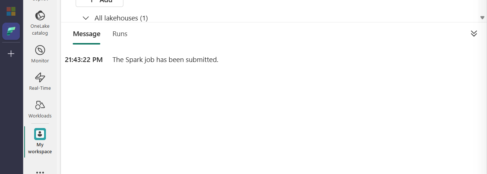

Navigate to the monitoring sub-system or the run history view. The telemetry tracker will display your manual trigger activity with an initial runtime status of **Starting** while the engine provisions infrastructure nodes.

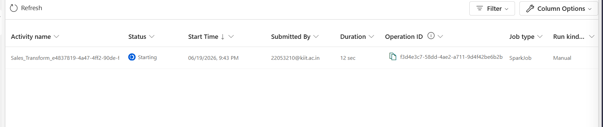

### 4. Monitor Live Cluster Execution
As the job provisions, you can drill directly into the localized workspace tracking messages. The background monitor panel provides real-time streaming notifications regarding application lifecycle phase shifts.

Once data mappings, aggregations, and compute tasks wrap up without warnings or structural failure breaks, the status engine will display a green checkmark indicating structural **Success**.

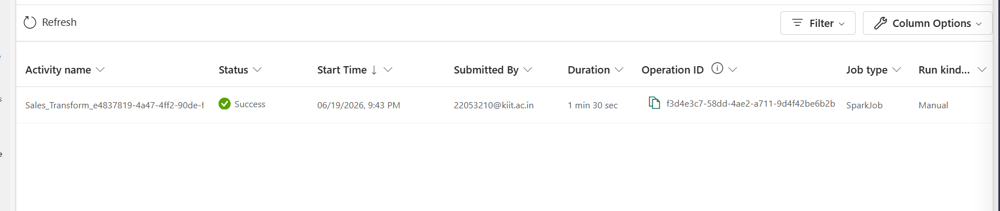

### 5. Output Verification & Deep Diagnostic Inspection
To review the calculations executed by your PySpark application, click into the finalized run row and expand the **Logs** tab. Select `Driver (stdout) -> Latest stdout` to inspect the tabular summaries generated by the program console.

*Note: If the output column yields `NULL` rows during data calculation tests, cross-check your underlying pipeline data join targets or input schema files to guarantee column values are fully populated.*

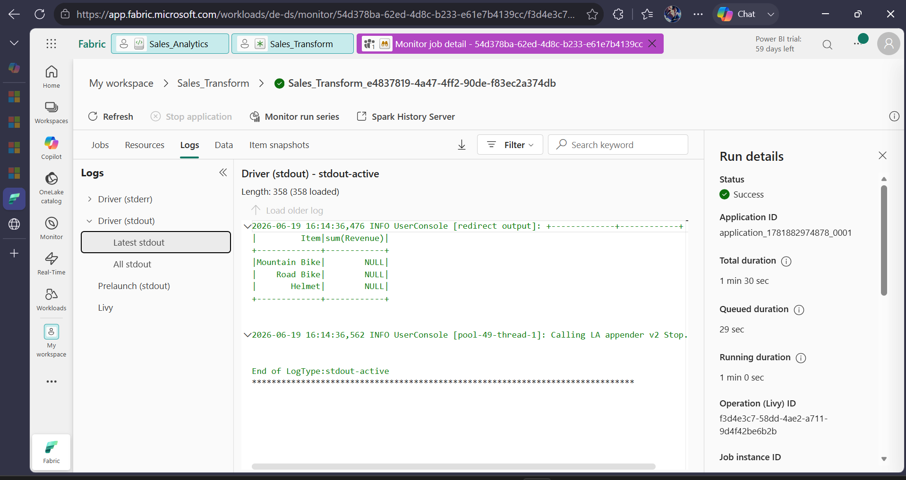

For infrastructure performance profiling, detailed stage run durations, or query plan tracking, click the **Spark History Server** link. This navigates to the core timeline dashboard detailing application metrics and executors.

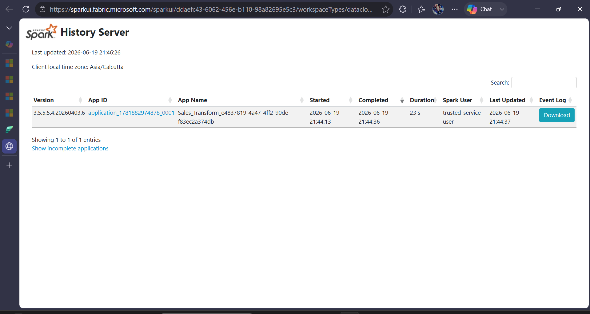

---

## 💻 Python Script Technical Breakdown [transform.py](./scripts/transform.py)

The automated core workload runs headless across the distributed architecture using the following code patterns:

* `SparkSession.builder.getOrCreate()`: Starts or reuses a Spark session to run big data commands.
* `header=True, inferSchema=True`: Tells Spark that the first row of our CSV contains column names, and asks Spark to automatically guess the data types (like numbers or text).
* `df.withColumn("Revenue", ...)`: Creates a brand new column named **Revenue** by multiplying the `Quantity` column by the `UnitPrice` column for every row.
* `df.groupBy("Item").sum("Revenue")`: Groups all matching items together (like all "Mountain Bikes") and adds up their total revenue.
* `agg.show()`: Prints the final calculated summary table directly into the Spark job logs.