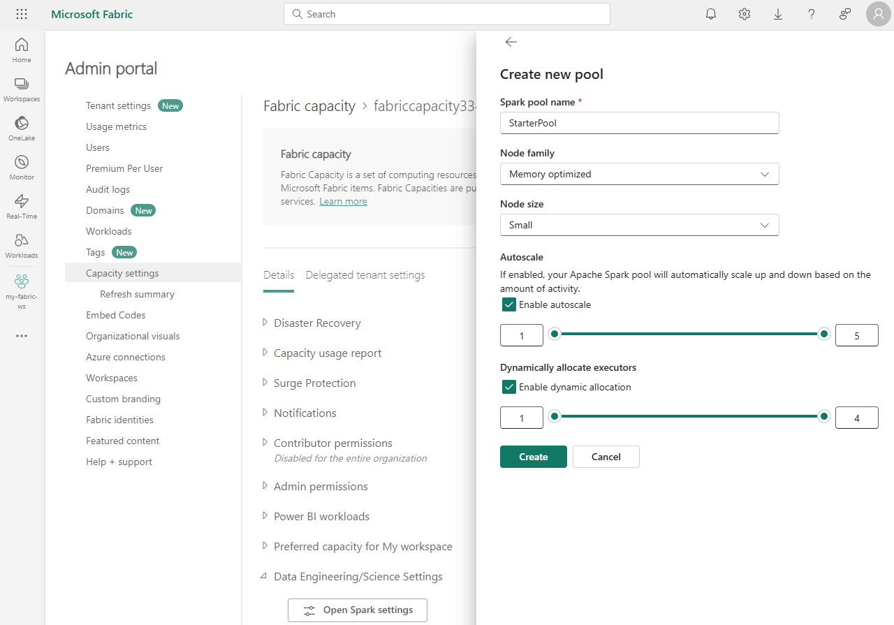
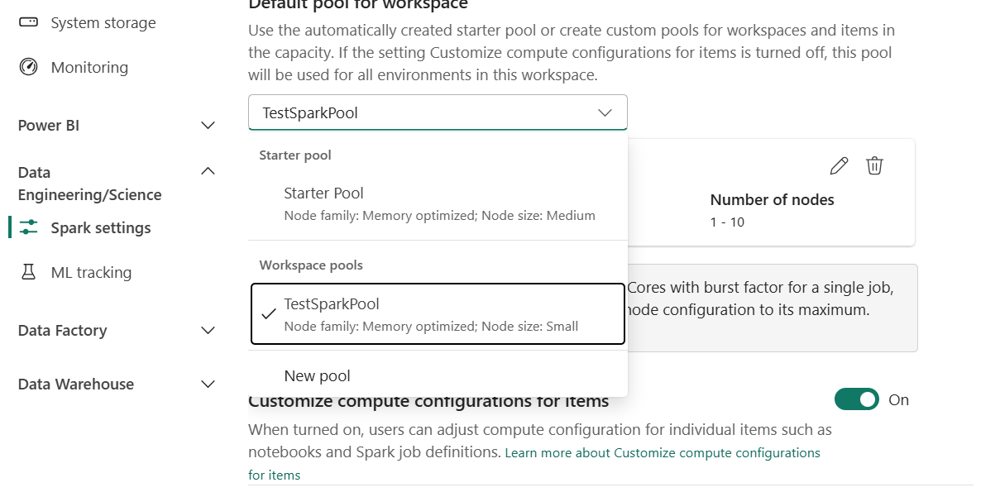
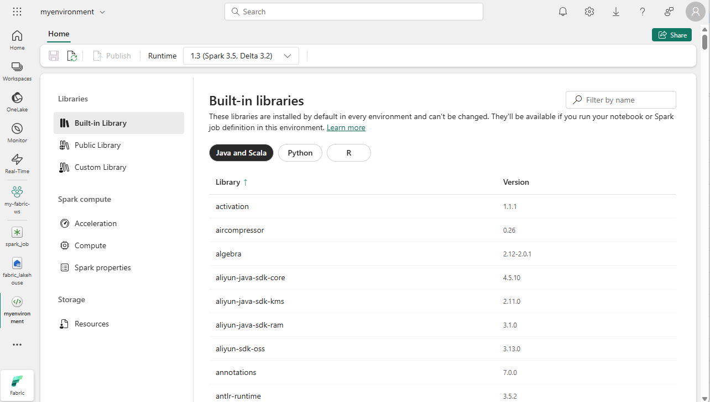
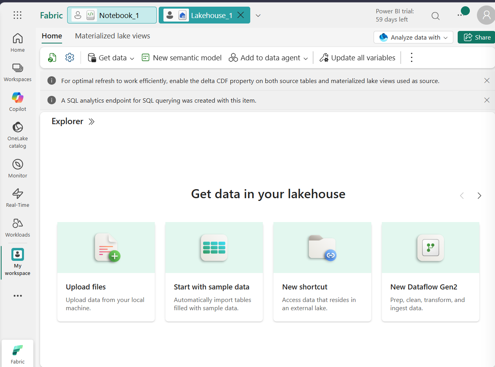
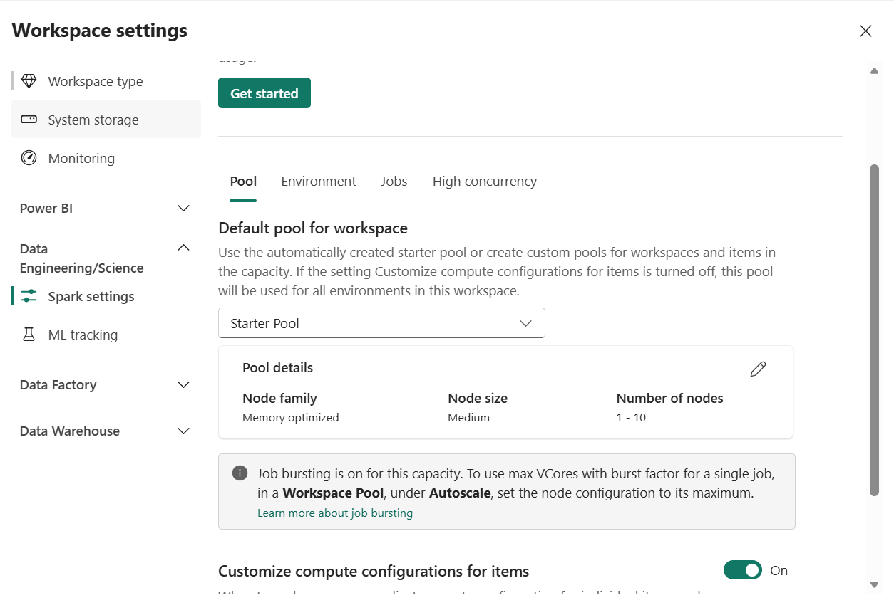

## 1. Spark Pool Creation Window  
- Go to Admin Portal → Capacity settings → Data Engineering/Science Settings.
- Screenshot:   
- Notes:
  - Options for node family, autoscale, dynamic allocation.
  - Starter pool is pre-configured; custom pool lets you choose settings.
  - Default pool for workspace can be set here.

---

## 2. Create Custom Spark Pools

Steps:  
- In the same Capacity settings section, click Create new pool.  
- Fill in:
    - Name (e.g., CustomPool1).
    - Node family and size.
    - Enable autoscale and dynamic allocation if needed. 
- Save and set as default pool if desired.  
- Screenshot:   

Notes:  
- Custom pools allow fine-grained control over compute resources.  
- Useful for workloads with specific performance/cost requirements.
- Once created, you can set this pool (or the starter pool) as the default pool for jobs that don’t specify a pool.

---

## 3. Set Default Pool
- In Workspace Settings → Data Engineering/Science Settings, choose which pool should be the default.

- This ensures notebooks/jobs run even if you don’t explicitly assign a pool.

---

## 4. Native Execution Engine Experiment Code  
This is where the experimental code comes in.  

Open a notebook in Fabric (inside your workspace):

- At the top of a cell, paste:
```python

  %%configure
  {
    "conf": {
        "spark.native.enabled": "true",
        "spark.shuffle.manager": "org.apache.spark.shuffle.sort.ColumnarShuffleManager"
    } 
  }
  ```

What this does:

- `spark.native.enabled`: `true` → turns on the native execution engine (vectorized processing directly on Lakehouse infra).

- `spark.shuffle.manager`: `ColumnarShuffleManager` → optimizes shuffle operations for columnar data (Parquet/Delta).

👉 Check out this notebook file [Notebook-1](./notebooks/Notebook_1.ipynb)

---

## 5. Runtime Settings
- Screenshot:   
- Notes:
  - Defines Spark version, Delta Lake version, Python version.
  - Add libraries from PyPI or upload custom ones.
  - Multiple runtimes supported; choose based on workload.

---

## 6. Lakehouse Connection
- Screenshot:   
- Notes:
  - Spark pool connects directly to OneLake Lakehouse.
  - Data can be queried with Spark SQL or PySpark.
  - Unified storage for structured + unstructured data.

---

## 7. Starter Pool Verification
- Screenshot:   
- Notes:
  - Workspace settings show Starter Pool (Memory optimized, Medium, 1–10 nodes).
  - Customize compute configurations toggle ON.
  - First notebook run took ~2 minutes (cold start).
  - Subsequent runs faster (warm pool).
  - Verified with:
    - `spark.conf.get("spark.native.enabled") → true`
    - `spark.conf.get("spark.shuffle.manager") → ColumnarShuffleManager`


