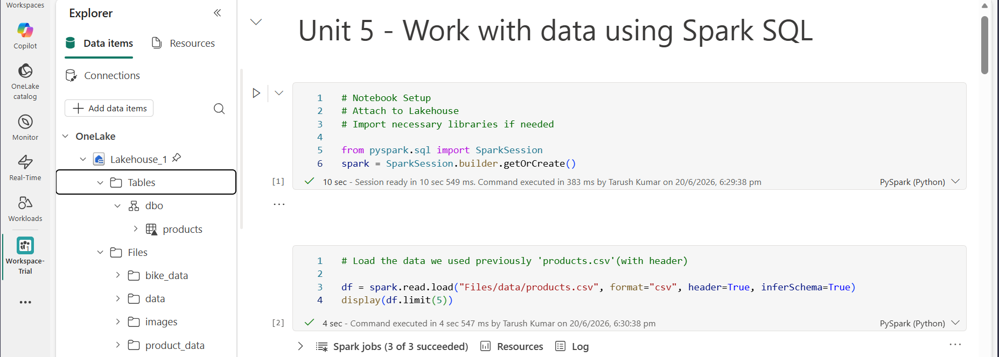
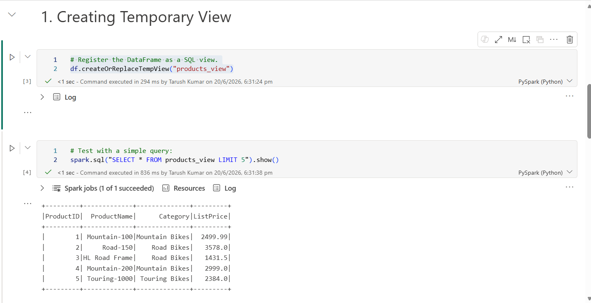
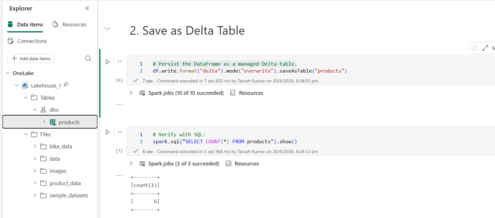
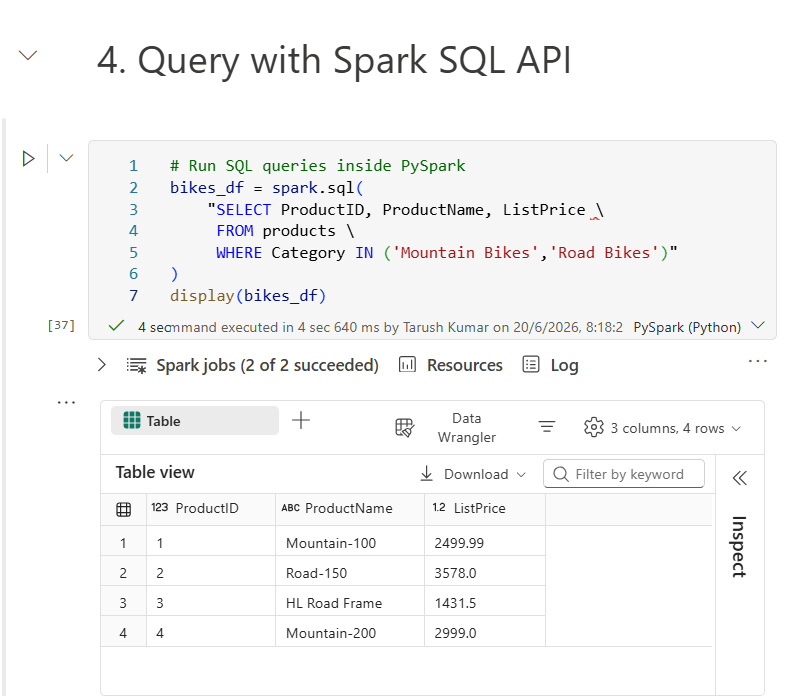
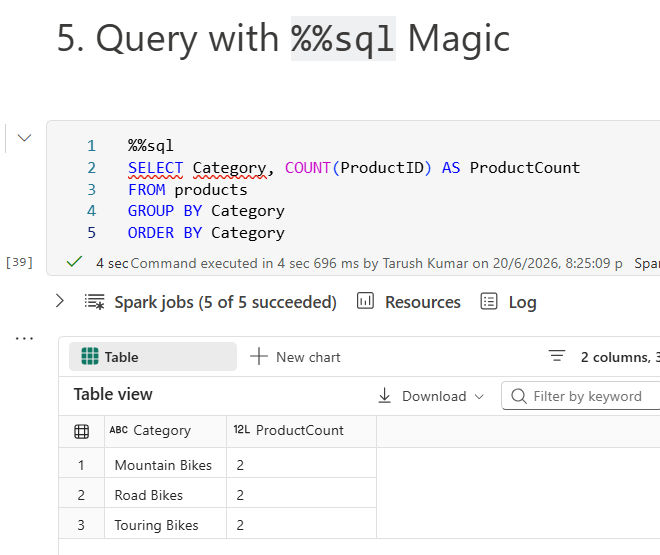
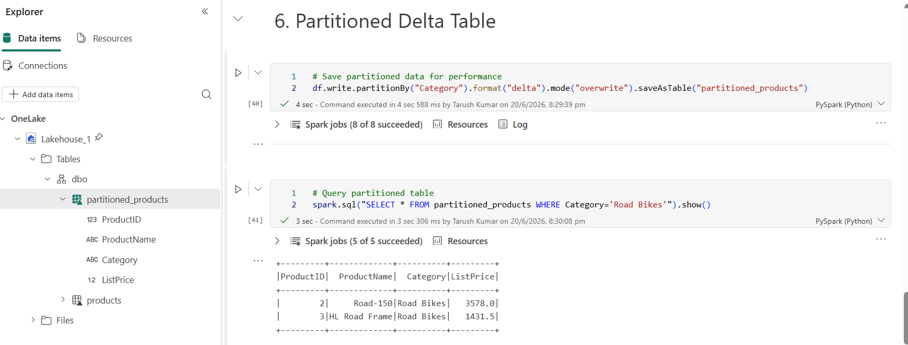

# Demo: Working with Data using Spark SQL

Before beginning make sure to attach your Notebook to your Lakehouse and that the [data file](./data/products.csv) is also uploaded in your lakehouse.

👉 Check out [Spark SQL Notebook](./notebooks/)  



---

## 1. Create Temporary View
You need to register the DataFrame as a SQL view.  
```python
df.createOrReplaceTempView("products_view")
```

and verify it with an SQL query:  


---

## 2. Save as Delta Table
Or, Persist the DataFrame as a managed Delta table.
```python
df.write.format("delta").saveAsTable("products")
```

and verify it with an SQL query:  
  
Notice how a persistent **Table** named `products` is created and stored in Lakehouse's Tables section.

---

## 3. Create External Table
```python
spark.catalog.createExternalTable(
    "external_products",
    path="Files/data/products.csv",
    source="csv",
    options={"header":"true"}
)
```

---

## 4. Query with Spark SQL API
```python
bikes_df = spark.sql(
    "SELECT ProductID, ProductName, ListPrice \
     FROM products \
     WHERE Category IN ('Mountain Bikes','Road Bikes')"
)
display(bikes_df)
```



---

## 5. Query with %%sql Magic
```python
%%sql
SELECT Category, COUNT(ProductID) AS ProductCount
FROM products
GROUP BY Category
ORDER BY Category
```



----

## 6. Partitioned Delta Table
```python
df.write.partitionBy("Category").format("delta").mode("overwrite").saveAsTable("partitioned_products")
```

