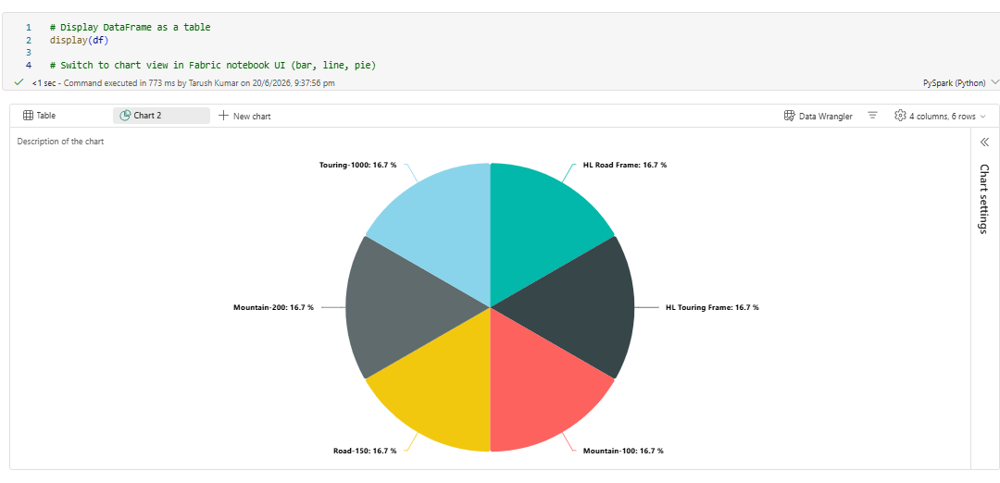
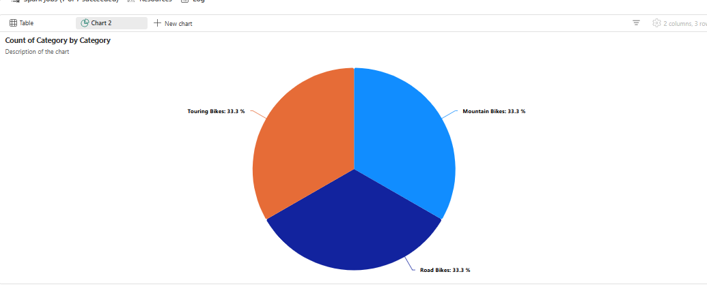
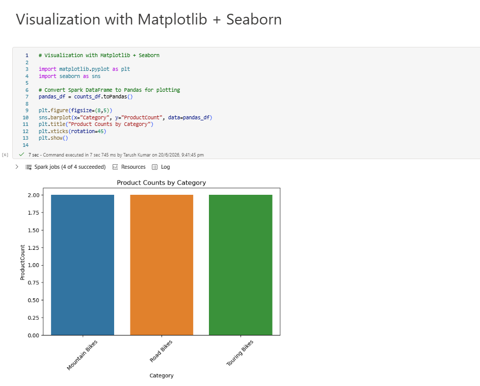
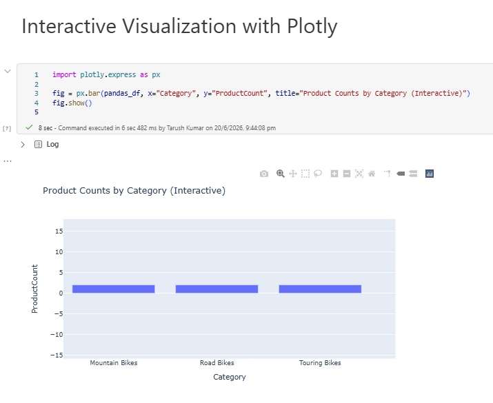

# Demo: Visualize Data in a Spark Notebook

This demo shows different ways to visualize data in Fabric notebooks using Spark SQL, built‑in display options, and Python visualization libraries.

---

## 1. Display DataFrame as Table and Chart
```python
df = spark.read.csv("Files/data/products.csv", header=True, inferSchema=True)
display(df)
```

- By default, this shows a table view.  
- In the notebook UI, switch to chart view (bar, line, pie) to visualize directly.  


---

## 2. SQL Query for Aggregation
```python
counts_df = spark.sql("""
SELECT Category, COUNT(ProductID) AS ProductCount
FROM products
GROUP BY Category
ORDER BY Category
""")
display(counts_df)
```

- Displays product counts grouped by category.
- You can switch to a bar chart in the notebook UI.  


---

## 3. Visualization with Matplotlib + Seaborn
```python
import matplotlib.pyplot as plt
import seaborn as sns

pandas_df = counts_df.toPandas()

plt.figure(figsize=(8,5))
sns.barplot(x="Category", y="ProductCount", data=pandas_df)
plt.title("Product Counts by Category")
plt.xticks(rotation=45)
plt.show()
```

- Converts Spark DataFrame to Pandas for plotting.
- Creates a bar chart with Seaborn.  


---

## 4. Interactive Visualization with Plotly
```python
import plotly.express as px

fig = px.bar(pandas_df, x="Category", y="ProductCount", title="Product Counts by Category (Interactive)")
fig.show()
```

- Creates an interactive bar chart with Plotly.
- Hover tooltips and zooming available.


---


```python
from matplotlib import pyplot as plt

# Get the data as a Pandas dataframe
data = spark.sql("SELECT Category, COUNT(ProductID) AS ProductCount \
                  FROM products \
                  GROUP BY Category \
                  ORDER BY Category").toPandas()

# Clear the plot area
plt.clf()

# Create a Figure
fig = plt.figure(figsize=(12,8))

# Create a bar plot of product counts by category
plt.bar(x=data['Category'], height=data['ProductCount'], color='orange')

# Customize the chart
plt.title('Product Counts by Category')
plt.xlabel('Category')
plt.ylabel('Products')
plt.grid(color='#95a5a6', linestyle='--', linewidth=2, axis='y', alpha=0.7)
plt.xticks(rotation=70)

# Show the plot area
plt.show()
```

You can use the Matplotlib library to create many kinds of chart; or if preferred, you can use other libraries such as Seaborn to create highly customized charts.