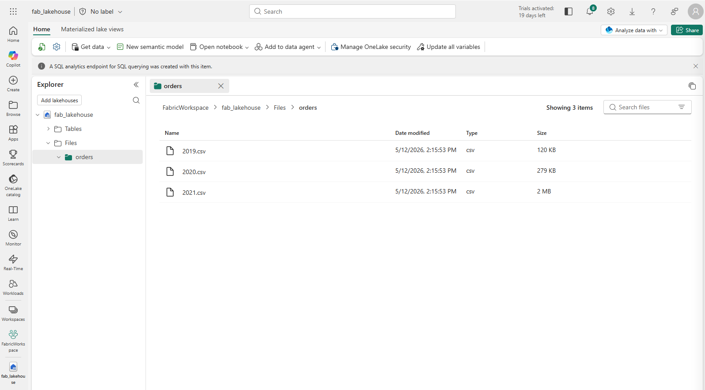
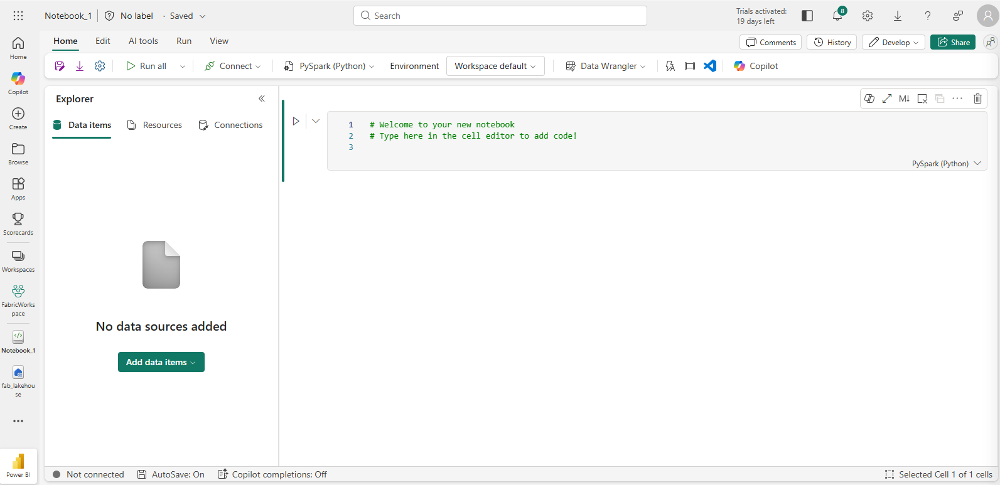
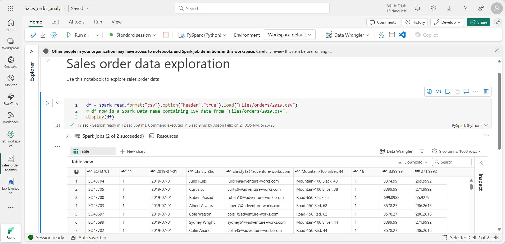
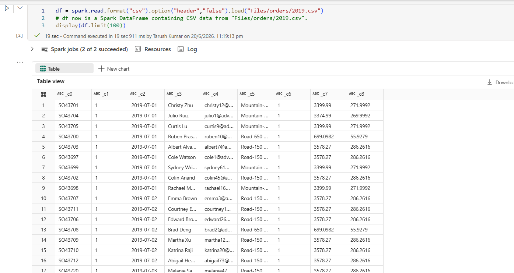
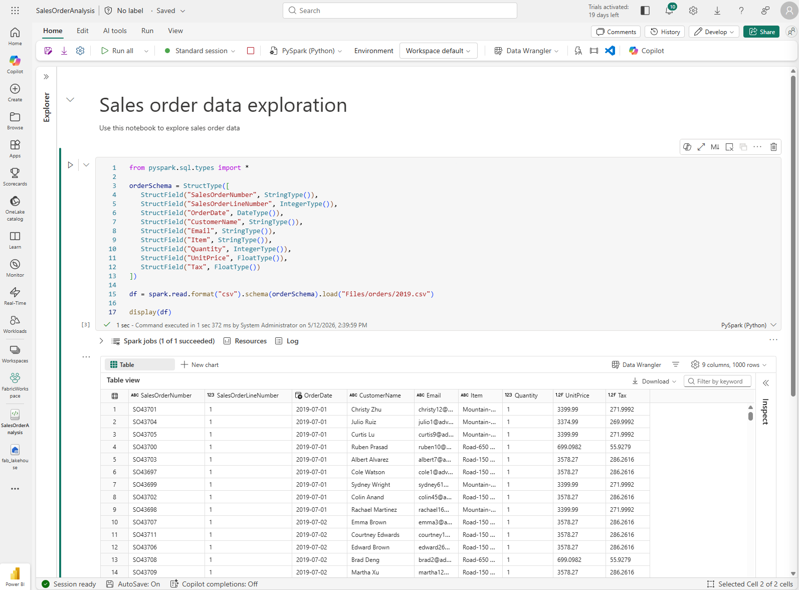
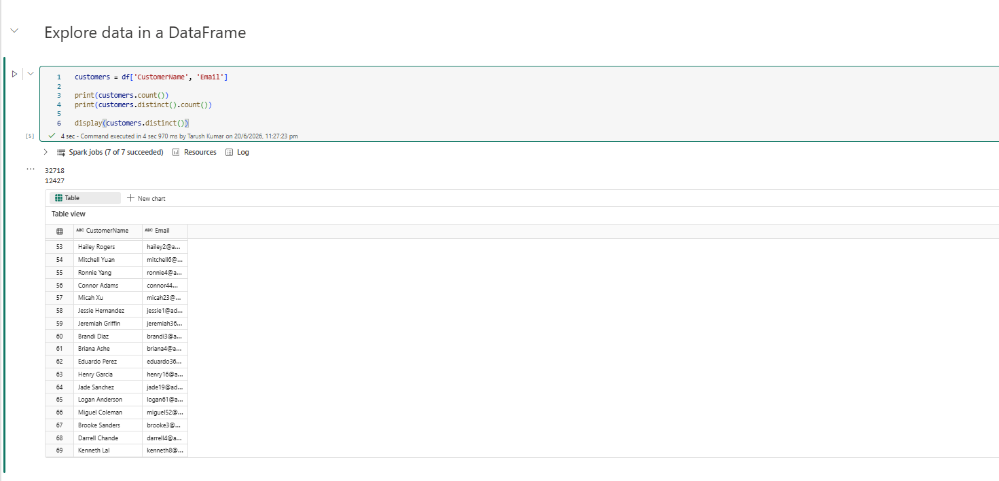

# Exercise - Analyze data with Apache Spark

> [!NOTE]: You need a Microsoft Fabric trial license with the Fabric preview enabled in your tenant.

> Launch the exercise and follow the instructions  
[Launch Exercise](https://microsoftlearning.github.io/mslearn-fabric/Instructions/Labs/02-analyze-spark.html)

**In this lab you will ingest data into a Fabric lakehouse and use PySpark to read and analyze the data.**

===

## Create a workspace

1. In the menu bar on the left, select Workspaces (the icon looks similar to 🗇).

2. Create a new workspace with a name of your choice, selecting a licensing mode in the Advanced section that includes Fabric capacity (Trial, Premium, or Fabric).

3. When your new workspace opens, it should be empty.


===

## Create a lakehouse and upload files

> Now that you have a workspace, it’s time to create a lakehouse for your data.

1. Select New Item and then select Lakehouse in the Store data section.

2. Give the lakehouse a unique name of your choice. Leave the Lakehouse schemas checkbox selected.

3. View the new lakehouse, and note that the Lakehouse explorer pane on the left enables you to browse tables and files in the lakehouse:


> You can now ingest data into the lakehouse. There are several ways to do this, but in this exercise I downloaded a folder of text files to my local computer and then uploaded them to my lakehouse.

4. Download the data files from: [here](https://github.com/MicrosoftLearning/dp-data/raw/main/orders.zip)  
CSVs file - [2019.csv](./orders/2019.csv), [2020.csv](./orders/2020.csv), [2021.csv](./orders/2021.csv)

5. Extract the zipped archive and verify that you have a folder named orders which contains three CSV files: `2019.csv`, `2020.csv`, and `2021.csv`.

6. Return to your new lakehouse. In the **Explorer** pane, next to the **Files** folder select the **…** menu, and select **Upload** and **Upload folder**. Navigate to the `orders` folder on your local computer and select Upload.

7. After the files have been uploaded, expand Files and select the orders folder. Check that the CSV files have been uploaded, as shown here:



===

## Create a notebook

1. In the lakehouse, select **Open notebook** > **New notebook**.

2. A new notebook named **Notebook** 1 is created and opened.



===

## Create a DataFrame

We will use PySpark, which is the default language for Fabric notebooks, and the version of Python that is optimized for Spark.

> [!NOTE] Fabric notebooks support multiple programming languages including Scala, R, and Spark SQL.

1. In the Explorer pane, expand Files and select the orders folder. The CSV files that you uploaded are listed next to the notebook editor.

2. From the … menu for 2019.csv, select **Load data** > **Spark**. The following code is automatically generated in a new code cell:
```python
df = spark.read.format("csv").option("header","true").load("Files/orders/2019.csv")
# df now is a Spark DataFrame containing CSV data from "Files/orders/2019.csv".
display(df.limit(100))
```

3. Select `▷ Run cell` to the left of the cell to run the code.

> [!NOTE] The first time you run Spark code, a Spark session is started. This can take a few seconds or longer. Subsequent runs within the same session will be quicker.



- The output shows data from the 2019.csv file displayed in columns and rows.  
- Notice that the column headers contain the first line of the data.  
- To correct this, you need to modify the first line of the existing code as follows:  
```python
df = spark.read.format("csv").option("header","false").load("Files/orders/2019.csv")
```

- Run the code again, so that the DataFrame correctly identifies the first row as data. Notice that the column names have now changed to _c0,_c1, etc.  



- Descriptive column names help you make sense of data. To create meaningful column names, you need to define the schema and data types. You also need to import a standard set of Spark SQL types to define the data types. Replace the existing code with the following:  

```python
from pyspark.sql.types import *

orderSchema = StructType([
    StructField("SalesOrderNumber", StringType()),
    StructField("SalesOrderLineNumber", IntegerType()),
    StructField("OrderDate", DateType()),
    StructField("CustomerName", StringType()),
    StructField("Email", StringType()),
    StructField("Item", StringType()),
    StructField("Quantity", IntegerType()),
    StructField("UnitPrice", FloatType()),
    StructField("Tax", FloatType())
])

df = spark.read.format("csv").schema(orderSchema).load("Files/orders/2019.csv")

display(df)
```




- This DataFrame includes only the data from the 2019.csv file. Modify the code so that the file path uses a `*` wildcard to read all the files in the orders folder:

```python
from pyspark.sql.types import *

orderSchema = StructType([
    StructField("SalesOrderNumber", StringType()),
    StructField("SalesOrderLineNumber", IntegerType()),
    StructField("OrderDate", DateType()),
    StructField("CustomerName", StringType()),
    StructField("Email", StringType()),
    StructField("Item", StringType()),
    StructField("Quantity", IntegerType()),
    StructField("UnitPrice", FloatType()),
    StructField("Tax", FloatType())
])

df = spark.read.format("csv").schema(orderSchema).load("Files/orders/*.csv")

display(df)
```

- When you run the modified code, you should see sales for 2019, 2020, and 2021. Only a subset of the rows is displayed, so you may not see rows for every year.

===

## Explore data in a DataFrame

The DataFrame object provides additional functionality such as the ability to filter, group, and manipulate data.

---

### 1. Filter a DataFrame

1. The following code filters the data so that only two columns are returned. It also uses count and distinct to summarize the number of records:

```python
 customers = df['CustomerName', 'Email']

 print(customers.count())
 print(customers.distinct().count())

 display(customers.distinct())
```


- The code creates a new DataFrame called customers which contains a subset of columns from the original df DataFrame

- When performing a DataFrame transformation you do not modify the original DataFrame, but return a new one.


2. Another way of achieving the same result is to use the select method:
```python
customers = df.select("CustomerName", "Email")
```

- The DataFrame functions *count* and *distinct* are used to provide totals for the number of customers and unique customers.


3. Modify the first line of the code by using *select* with a where function as follows:

```py
customers = df.select("CustomerName", "Email").where(df['Item']=='Road-250 Red, 52')
print(customers.count())
print(customers.distinct().count())

display(customers.distinct())
```

- Run the modified code to select only the customers who have purchased the Road-250 Red, 52 product. 
> [!Note] that you can **“chain”** multiple functions together so that the output of one function becomes the input for the next. In this case, the DataFrame created by the *select* method is the source DataFrame for the *where* method that is used to apply filtering criteria.


---


### 2. Aggregate and group data in a DataFrame

1. 
```python
productSales = df.select("Item", "Quantity").groupBy("Item").sum()

display(productSales)
```
- The results show the sum of order quantities grouped by product. The *groupBy* method groups the rows by Item, and the subsequent *sum* aggregate function is applied to the remaining numeric columns - in this case, Quantity.


2. 
```py
from pyspark.sql.functions import *

yearlySales = df.select(year(col("OrderDate")).alias("Year")).groupBy("Year").count().orderBy("Year")

display(yearlySales)
```

- The results now show the number of sales orders per year:

    - The *import* statement enables you to use the *Spark SQL library*.  
    - The *select* method is used with a SQL year function to extract the year component of the *OrderDate* field.  
    - The *alias* method is used to assign a column name to the extracted year value.  
    - The *groupBy* method groups the data by the derived Year column.  
    - The *count* of rows in each group is calculated before the *orderBy* method is used to sort the resulting DataFrame.


===

## Use Spark to transform data files
A common task for data engineers and data scientists is to transform data for further downstream processing or analysis.

---

### 1. Use DataFrame methods and functions to transform data

1. 
```py
from pyspark.sql.functions import *

# Create Year and Month columns
transformed_df = df.withColumn("Year", year(col("OrderDate"))).withColumn("Month", month(col("OrderDate")))

# Create the new FirstName and LastName fields
transformed_df = transformed_df.withColumn("FirstName", split(col("CustomerName"), " ").getItem(0)).withColumn("LastName", split(col("CustomerName"), " ").getItem(1))

# Filter and reorder columns
transformed_df = transformed_df["SalesOrderNumber", "SalesOrderLineNumber", "OrderDate", "Year", "Month", "FirstName", "LastName", "Email", "Item", "Quantity", "UnitPrice", "Tax"]

# Display the first five orders
display(transformed_df.limit(5))
```

2. A new DataFrame is created from the original order data with the following transformations:

    - Year and Month columns added, based on the OrderDate column.
    - FirstName and LastName columns added, based on the CustomerName column.
    - The columns are filtered and reordered, and the CustomerName column removed.
    - Review the output and verify that the transformations have been made to the data.

2. You can use the Spark SQL library to transform the data by filtering rows, deriving, removing, renaming columns, and applying other data modifications.

---

### 2. Save the transformed data
1. Save the transformed data so that it can be used for further analysis.

2. Parquet is a popular data storage format because it stores data efficiently and is supported by most large-scale data analytics systems. Indeed, sometimes the data transformation requirement is to convert data from one format such as CSV, to Parquet.

3. To save the transformed DataFrame in Parquet format:

```py
transformed_df.write.mode("overwrite").parquet('Files/transformed_data/orders')

print ("Transformed data saved!")
```

- In the Explorer pane on the left, in the … menu for the Files node, select Refresh. Select the transformed_data folder to verify that it contains a new folder named orders, which in turn contains one or more Parquet files.


4. 
```py
orders_df = spark.read.format("parquet").load("Files/transformed_data/orders")
display(orders_df)
```

A new DataFrame is created from the parquet files in the transformed_data/orders folder. Verify that the results show the order data that has been loaded from the parquet files.

Screen picture showing Parquet files.

---

### 3. Save data in partitioned files
When dealing with large volumes of data, partitioning can significantly improve performance and make it easier to filter data.

Add a cell with code to save the dataframe, partitioning the data by Year and Month:

code
orders_df.write.partitionBy("Year","Month").mode("overwrite").parquet("Files/partitioned_data")

print ("Transformed data saved!")
Run the cell and wait for the message that the data has been saved. Then, in the Lakehouses pane on the left, in the … menu for the Files node, select Refresh and expand the partitioned_data folder to verify that it contains a hierarchy of folders named Year=xxxx, each containing folders named Month=xxxx. Each month folder contains a parquet file with the orders for that month.

Screen picture showing data partitioned by Year and Month.

Add a new cell with the following code to load a new DataFrame from the orders.parquet file:

code
orders_2021_df = spark.read.format("parquet").load("Files/partitioned_data/Year=2021/Month=*")

display(orders_2021_df)
Run the cell and verify that the results show the order data for sales in 2021. Notice that the partitioning columns specified in the path (Year and Month) are not included in the DataFrame.

===

## Work with tables and SQL
You’ve now seen how the native methods of the DataFrame object enable you to query and analyze data from a file. However, you may be more comfortable working with tables using SQL syntax. Fabric lakehouses support Delta tables, which are stored in OneLake and can be queried using Spark SQL.

The Spark SQL library supports the use of SQL statements to query Delta tables in the lakehouse. This provides the flexibility of a data lake with the structured data schema and SQL-based queries of a relational data warehouse — hence the term “data lakehouse”.

Create a table
Delta tables in a Fabric lakehouse are relational abstractions over files stored in OneLake.

Add a code cell to the notebook and enter the following code, which saves the DataFrame of sales order data as a table named salesorders:

code
 # Create a new table
 df.write.format("delta").saveAsTable("salesorders")

 # Get the table description
 spark.sql("DESCRIBE EXTENDED salesorders").show(truncate=False)
[!NOTE] The table is saved in Delta format, which adds relational database capabilities including support for transactions, row versioning, and other useful features. The table files are stored in the lakehouse’s Tables folder in OneLake and managed by the Fabric lakehouse.

Run the code cell and review the output, which describes the definition of the new table.

In the Explorer pane, in the … menu for the Tables folder, select Refresh. Then expand the Tables node and verify that the salesorders table has been created.

Screen picture showing that the salesorders table has been created.

In the … menu for the salesorders table, select Load data > Spark. A new code cell is added containing code similar to the following:

code
df = spark.sql("SELECT * FROM [your_lakehouse].dbo.salesorders LIMIT 1000")

display(df)
Run the new code, which uses the Spark SQL library to embed a SQL query against the salesorder table in PySpark code and load the results of the query into a DataFrame.

Run SQL code in a cell
While it’s useful to be able to embed SQL statements into a cell containing PySpark code, data analysts often just want to work directly in SQL.

Add a new code cell to the notebook, and enter the following code:

code
%%sql
SELECT YEAR(OrderDate) AS OrderYear,
       SUM((UnitPrice * Quantity) + Tax) AS GrossRevenue
FROM salesorders
GROUP BY YEAR(OrderDate)
ORDER BY OrderYear;
Run the cell and review the results. Observe that:

The %%sql command at the beginning of the cell (called a magic) changes the language to Spark SQL instead of PySpark.
The SQL code references the salesorders table that you created previously.
The output from the SQL query is automatically displayed as the result under the cell.
[!NOTE] For more information about Spark SQL and dataframes, see the Apache Spark SQL documentation.

===

## Visualize data with Spark
Charts help you to see patterns and trends faster than would be possible by scanning thousands of rows of data. Fabric notebooks include a built-in chart view but it is not designed for complex charts. For more control over how charts are created from data in DataFrames, use Python graphics libraries like matplotlib or seaborn.

View results as a chart
Add a new code cell, and enter the following code:

code
%%sql
SELECT * FROM salesorders
Run the code to display data from the salesorders table you created previously. In the results section beneath the cell, select + New chart.

Use the Build my own button at the bottom-right of the results section and set the chart settings:

Chart type: Bar chart
X-axis: Item
Y-axis: Quantity
Series Group: –None–
Aggregation: Sum
Missing and NULL values: Display as 0
Stacked: Unselected
Your chart should look similar to this:

Screen picture of Fabric notebook chart view.

Get started with matplotlib
Add a new code cell, and enter the following code:

code
sqlQuery = "SELECT CAST(YEAR(OrderDate) AS CHAR(4)) AS OrderYear, \
                SUM((UnitPrice * Quantity) + Tax) AS GrossRevenue, \
                COUNT(DISTINCT SalesOrderNumber) AS YearlyCounts \
            FROM salesorders \
            GROUP BY CAST(YEAR(OrderDate) AS CHAR(4)) \
            ORDER BY OrderYear"
df_spark = spark.sql(sqlQuery)
df_spark.show()
Run the code. It returns a Spark DataFrame containing the yearly revenue and number of orders. To visualize the data as a chart, we’ll first use the matplotlib Python library. This library is the core plotting library on which many others are based and provides a great deal of flexibility in creating charts.

Add a new code cell, and add the following code:

code
from matplotlib import pyplot as plt

# matplotlib requires a Pandas dataframe, not a Spark one
df_sales = df_spark.toPandas()

# Create a bar plot of revenue by year
plt.bar(x=df_sales['OrderYear'], height=df_sales['GrossRevenue'])

# Display the plot
plt.show()
Run the cell and review the results, which consist of a column chart with the total gross revenue for each year. Review the code, and notice the following:

The matplotlib library requires a Pandas DataFrame, so you need to convert the Spark DataFrame returned by the Spark SQL query.
At the core of the matplotlib library is the pyplot object. This is the foundation for most plotting functionality.
The default settings result in a usable chart, but there’s considerable scope to customize it.
Modify the code to plot the chart as follows:

code
 from matplotlib import pyplot as plt

 # Clear the plot area
 plt.clf()

 # Create a bar plot of revenue by year
 plt.bar(x=df_sales['OrderYear'], height=df_sales['GrossRevenue'], color='orange')

 # Customize the chart
 plt.title('Revenue by Year')
 plt.xlabel('Year')
 plt.ylabel('Revenue')
 plt.grid(color='#95a5a6', linestyle='--', linewidth=2, axis='y', alpha=0.7)
 plt.xticks(rotation=45)

 # Show the figure
 plt.show()
Re-run the code cell and view the results. The chart is now easier to understand.
A plot is contained with a Figure. In the previous examples, the figure was created implicitly but it can be created explicitly. Modify the code to plot the chart as follows:

code
from matplotlib import pyplot as plt

# Clear the plot area
plt.clf()

# Create a Figure
fig = plt.figure(figsize=(8,3))

# Create a bar plot of revenue by year
plt.bar(x=df_sales['OrderYear'], height=df_sales['GrossRevenue'], color='orange')

# Customize the chart
plt.title('Revenue by Year')
plt.xlabel('Year')
plt.ylabel('Revenue')
plt.grid(color='#95a5a6', linestyle='--', linewidth=2, axis='y', alpha=0.7)
plt.xticks(rotation=45)

# Show the figure
plt.show()
Re-run the code cell and view the results. The figure determines the shape and size of the plot.
A figure can contain multiple subplots, each on its own axis. Modify the code to plot the chart as follows:

code
from matplotlib import pyplot as plt

# Clear the plot area
plt.clf()

# Create a figure for 2 subplots (1 row, 2 columns)
fig, ax = plt.subplots(1, 2, figsize = (10,4))

# Create a bar plot of revenue by year on the first axis
ax[0].bar(x=df_sales['OrderYear'], height=df_sales['GrossRevenue'], color='orange')
ax[0].set_title('Revenue by Year')

# Create a pie chart of yearly order counts on the second axis
ax[1].pie(df_sales['YearlyCounts'])
ax[1].set_title('Orders per Year')
ax[1].legend(df_sales['OrderYear'])

# Add a title to the Figure
fig.suptitle('Sales Data')

# Show the figure
plt.show()
Re-run the code cell and view the results.
[!NOTE] To learn more about plotting with matplotlib, see the matplotlib documentation.

Use the seaborn library
While matplotlib enables you to create different chart types, it can require some complex code to achieve the best results. For this reason, new libraries have been built on matplotlib to abstract its complexity and enhance its capabilities. One such library is seaborn.

Add a new code cell to the notebook, and enter the following code:

code
import seaborn as sns
import warnings

# Clear the plot area
plt.clf()

# Suppress FutureWarning from seaborn
warnings.filterwarnings('ignore', message='use_inf_as_na', category=FutureWarning)

# Create a bar chart
ax = sns.barplot(x="OrderYear", y="GrossRevenue", data=df_sales)

plt.show()
Run the code to display a bar chart created using the seaborn library.
Modify the code as follows:

code
import seaborn as sns

# Clear the plot area
plt.clf()

# Set the visual theme for seaborn
sns.set_theme(style="whitegrid")

# Create a bar chart
ax = sns.barplot(x="OrderYear", y="GrossRevenue", data=df_sales)

plt.show()
Run the modified code and note that seaborn enables you to set a color theme for your plots.
Modify the code again as follows:

code
 import seaborn as sns

 # Clear the plot area
 plt.clf()

 # Create a line chart
 ax = sns.lineplot(x="OrderYear", y="GrossRevenue", data=df_sales)

 plt.show()
Run the modified code to view the yearly revenue as a line chart.
[!NOTE] To learn more about plotting with seaborn, see the seaborn documentation.

===

## Clean up resources
In this exercise, you’ve learned how to use Spark to work with data in Microsoft Fabric.

If you’ve finished exploring your data, you can end the Spark session and delete the workspace that you created for this exercise.

On the notebook menu, select Stop session to end the Spark session.
In the bar on the left, select the icon for your workspace to view all of the items it contains.
Select Workspace settings and in the General section, scroll down and select Remove this workspace.
Select Delete to delete the workspace.