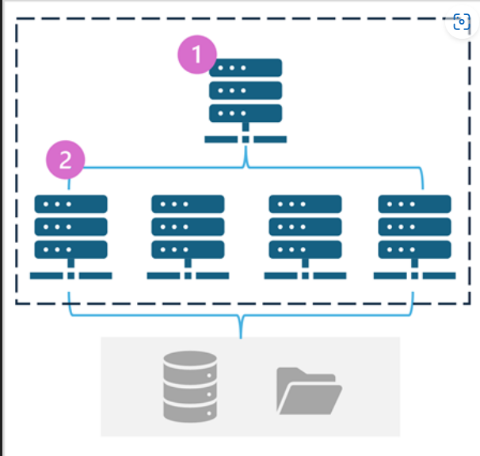
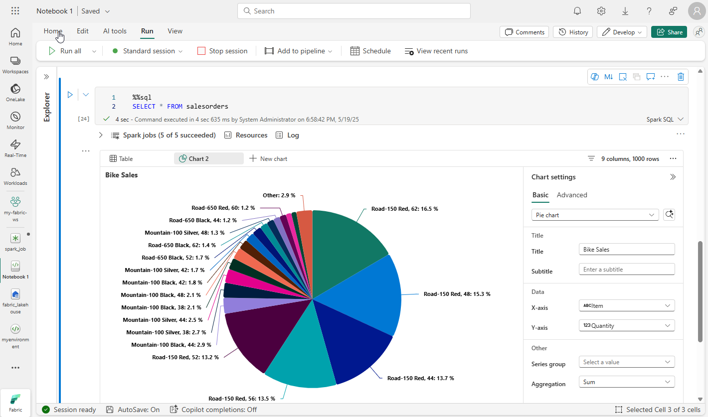

# Use Apache Spark in Microsoft Fabric Module

## Unit 1: Introduction

- Apache Spark is an open-source distributed-parallel processing framework for large-scale data(big data) processing and analytics.   
- Developed under the Apache Software Foundation.  
- Spark is widely used in "big data" scenarios and is available in multiple platforms, including Azure HDInsight, Azure Synapse Analytics, and Microsoft Fabric.  
- Microsoft Fabric integrates Spark with other services like Lakehouse and Power BI.   
- Spark is faster than older frameworks like Hadoop MapReduce because it supports in-memory computation.  
- This module focuses on using Spark in Microsoft Fabric to ingest, process, and analyze data in a lakehouse.   
- While Spark techniques are common across implementations, Microsoft Fabric integrates Spark with other data services, making it easier to build end-to-end analytics solutions.   
- Big Data = datasets too large/complex for traditional single-machine tools (like Pandas).  
- In-memory processing → Spark keeps data in RAM for faster computation.  
- Disk-based processing → Hadoop MapReduce writes intermediate results to disk, slower due to I/O.  
- Spark can spill to disk if RAM is insufficient, but prefers memory.  
- Pandas also works in-memory, but only on one machine (not distributed).  

---

## Unit 2: Prepare to use Apache Spark

- Spark is a distributed data processing framework that uses a "divide and conquer" approach across multiple nodes in a cluster.   
- In Microsoft Fabric, these clusters are called **Spark pools**.

### Spark Pools
A Spark pool consists of compute nodes that distribute data processing tasks.  


- Head node → runs driver program, coordinates tasks.  
- Worker nodes → executors that perform actual processing.  
- Supports Java, Scala, R, SQL, PySpark.  
- Can process data stored in **OneLake Lakehouse**.

### Spark Pools in MS Fabric
Fabric provides a starter pool in each workspace for quick setup.  
You can manage settings in the Admin portal under **Capacity settings → Data Engineering/Science Settings**.  

👉 For a **Configuration Example**, see [Spark Pools Setup](./demo/spark-pool.md#1-spark-pool-creation-window)

Pool configuration settings include:
- Node family (VM type, usually memory-optimized)  
- Autoscale (auto-provision nodes)  
- Dynamic allocation (adjust executors based on data volume)  

### Runtime and Environments
- **1. Spark runtimes in Microsoft Fabric**  
  Define versions of Spark, Delta Lake, Python, and libraries. Multiple runtimes supported.  

- **2. Environments in Microsoft Fabric**  
  Custom environments allow specific runtimes, libraries (PyPI/custom), Spark pools, and overrides.  

### Additional Spark Configuration Options
- **1. Native execution engine** → vectorized processing directly on Lakehouse infra, faster for Parquet/Delta.  
- **2. High concurrency mode** → share Spark sessions across multiple users safely.  
- **3. Automatic MLFlow logging** → logs ML experiments automatically.  
- **4. Spark administration for a Fabric capacity** → manage Spark pools at capacity level (permissions, usage, DR, surge protection).  

👉 [See demo for code snippet](./demo/spark-pool.md#4-native-execution-engine-experiment-code)

### Spark Pool Architecture (Text Diagram)

                ┌───────────────────────────────┐
                │        Spark Pool             │
                └───────────────────────────────┘
                           │
                           ▼
        ┌───────────────────────────────────────────┐
        │                 Head Node                 │
        │   - Runs Driver Program                   │
        │   - Coordinates tasks across workers      │
        └───────────────────────────────────────────┘
                           │
                           ▼
        ┌───────────────────────────────────────────┐
        │               Worker Nodes                │
        │   - Executors run tasks                   │
        │   - Store data in memory (RAM)            │
        │   - Communicate with OneLake storage      │
        └───────────────────────────────────────────┘
                           │
                           ▼
        ┌───────────────────────────────────────────┐
        │             OneLake Lakehouse             │
        │   - Unified storage for structured +      │
        │     unstructured data                     │
        │   - Accessible by Spark SQL, PySpark, etc.│
        └───────────────────────────────────────────┘

---

## Unit 3: Run Spark Jobs

### Running Spark in Fabric
- Two main options:
  - **Notebooks** → interactive, cell‑based, immediate results.
  - **Spark Job Definitions** → automated, repeatable, can be scheduled.

### Notebooks

When you want to use Spark to explore and analyze data interactively, use a notebook.  
- Combine text, images, and code (Python, Scala, R, SQL).
- Organized into **cells** (markdown or executable code).
- Results appear inline after execution.
- Best for exploration, learning, and analysis.

**Example:**
```python
data = [("Tarush", 1), ("Copilot", 2)]
df = spark.createDataFrame(data, ["Name", "Value"])
df.show()
```
👉 Check out [Sales Analytics Notebook](./demo/notebooks/Sales_Analytics.ipynb)  
👉 Short notes [Click here](./demo/run-spark-code.md#-fabric-data-engineer-notebook-sales-order-exploration)

### Spark Job Definitions

If you want to use Spark to ingest and transform data as part of an automated process, you can define a Spark job to run a script on-demand or based on a schedule.

- Define a script to run on‑demand or on a schedule.  
- Can reference external files (e.g., Python helper libraries).  
- Attach to a specific Lakehouse for data access.  
- Best for production pipelines and repeatable transformations.  

#### Example Setup:
- Script: transform.py
- References: utils.py for helper functions
- Lakehouse: Lakehouse_1
- Schedule: Daily at 9 AM

👉 Short notes [Click here](./demo/run-spark-code.md#️-spark-job-definition-automated-etl--sales-transform)

### Key Differences
| Feature | Notebook | Spark Job Definition |
| --- | --- | --- |
| Purpose | Interactive exploration | Automated pipelines |
| Execution | Manual, cell‑by‑cell | Scheduled or on‑demand |
| Output | Inline results | Logs + Lakehouse updates |
| Best Use Case | Learning, prototyping | Production ETL, batch jobs |

---

## Unit 4: Working with data in a Spark dataframe

Natively, Spark uses a data structure called a **resilient distributed dataset (RDD)**; but while you can write code that works directly with RDDs, the most commonly used data structure for working with structured data in Spark is the dataframe, which is provided as part of the `Spark SQL` library. Dataframes in Spark are similar to those in the ubiquitous Pandas Python library, but optimized to work in Spark's distributed processing environment.

**Note** : In addition to the Dataframe API, Spark SQL provides a strongly-typed Dataset API that is supported in Java and Scala. We'll focus on the Dataframe API in this module.

### What is a DataFrame?  
- Spark’s primary abstraction for structured data.
- Similar to Pandas DataFrames, but distributed across a cluster (optimized for Spark distributed processing environment).
- Built on top of Spark SQL.

### Loading data into a dataframe
We can have two cases:  
- Data file has column names included [products.csv](./demo/data/products.csv)
- Data file does not have a column name [product-data.csv](./demo/data/product-data.csv)

**1. With Header (Schema Inferred)**  
- Load CSV files directly into a DataFrame.
- Spark can **infer schema** from headers and data types.  
  👉 See [Demo: Load CSV with Inferred Schema](./demo/spark-dataframe.md#load-csv-with-inferred-schema)  

**2. Without header (explicit schema)**  
Define schema when headers are missing or for performance.  
  👉 See [Demo: Load CSV with Explicit Schema](./demo/spark-dataframe.md#load-csv-with-explicit-schema)  


### Transformations : Filtering and Grouping dataframes
You can use the methods of the Dataframe class to filter, sort, group, and otherwise manipulate the data it contains.

Select, where, filter, groupBy examples:  
  👉 See [Demo: Transformations](./demo/spark-dataframe.md#transformations)


### Saving Data  
You'll often want to use Spark to transform raw data and save the results for further analysis or downstream processing. The following code example saves the dataFrame into a parquet file in the data lake, replacing any existing file of the same name.  
  👉 See [Demo: Saving Data](./demo/spark-dataframe.md#saving-data)

**Partitioning the Output File**  
Partitioning is an optimization technique that enables Spark to maximize performance across the worker nodes. More performance gains can be achieved when filtering data in queries by eliminating unnecessary disk IO.  
  👉 See [Demo: Partioning Output File](./demo/spark-dataframe.md#partition-output-for-performance)

### Load Partitioned Data
  - Load only specific partitions.  
When reading partitioned data into a dataframe, you can load data from any folder within the hierarchy by specifying explicit values or wildcards for the partitioned fields. The following example loads data for products in the Road Bikes category:  
  👉 See [Demo: Load Partitioned Data](./demo/spark-dataframe.md#loading-partitioned-data)

---

## Unit 5: Work with Data using Spark SQL
The Dataframe API is part of a Spark library named Spark SQL, which enables data analysts to use SQL expressions to query and manipulate data.

### Spark SQL Overview
- Spark SQL is a library in Spark that lets you query structured data using SQL syntax.  
- It integrates seamlessly with the DataFrame API, so you can switch between code and SQL queries.  
- Useful for data analysts who prefer SQL over Python/Scala code.  

### Spark Catalog
- The Spark catalog is a **metastore** that holds relational objects like **views** and **tables**.  
- It enables cross‑language integration: you can write code in any Spark supported language (e.g., Python/Scala) and query the same data with SQL.  
- Catalog objects:  
  - **Temporary Views** → exist only for the current session.  
  - **Managed Tables** → stored in the Lakehouse Tables area; deleting them also deletes underlying data.  
  - **External Tables** → metadata stored in catalog, but data resides in external storage (e.g., Files folder). Deleting them doesn’t remove the data.

### Creating database objects in the Spark catalog

#### 1. Creating Views
- One of the simplest ways to make data in a dataframe available for querying in the Spark catalog is to create a temporary view.  
- Temporary views make DataFrames queryable with SQL.  
- Example:  
  ```python
  df.createOrReplaceTempView("products_view")
  ```
- This view disappears when the session ends.

  👉 [See demo: Create Temp View](./demo/spark-sql.md#1-create-temporary-view)  

#### 2. Creating Tables
- Save DataFrames as tables for persistent storage.  
- Tables are metadata structures that store their underlying data in the storage location associated with the catalog.  
- Example:  
```python
df.write.format("delta").saveAsTable("products")
```
- Tables are stored in the Lakehouse **Tables** section.  
- **Delta format** is preferred in Fabric:
    - Supports transactions, versioning, and streaming. 
    - Acts like a relational database table but on big data.

  👉 [See demo: Save as Delta Table](./demo/spark-sql.md#2-save-as-delta-table)  

#### 3. External Tables
- Created with `spark.catalog.createExternalTable`.  
- Point to data in external storage (e.g., `Files/orders/`).  
- Metadata lives in catalog, but data remains in Files.  
- Deleting external table does not delete the data.  

  👉 [See demo: Create External Table](./demo/spark-sql.md#3-create-external-table)  

  **Important** : This code was not working for me. I spent one hour trying different solutions like - using the ABFS path, used CREATE TABLE, furthermore since `.createExternalTable()` method is deprecated since spark 2.2 I changed it to `.createTable()` and even then nothing changed. So focus on other methods in this unit.

#### 4. Partitioning Tables
- Same concept as partitioned Parquet files.  
- Improves query performance by reducing unnecessary reads.  
- Example: partitioning by Category in a Delta table.  

  👉 [See demo: Partitioned Delta Table](./demo/spark-sql.md#6-partitioned-delta-table)  

### Querying with Spark SQL API  
You can use the Spark SQL API in code written in any language to query data in the catalog. For example, the following PySpark code uses a SQL query to return data from the products table as a dataframe.
```python
bikes_df = spark.sql(
    "SELECT ProductID, ProductName, ListPrice \
     FROM products \
     WHERE Category IN ('Mountain Bikes', 'Road Bikes')"
)
display(bikes_df)
```  

  👉 [See demo: Query with Spark SQL API](./demo/spark-sql.md#4-query-with-spark-sql-api)  

### Querying with `%%sql` Magic
The previous example demonstrated how to use the Spark SQL API to embed SQL expressions in Spark code. In a notebook, you can also use the `%%sql` magic to run SQL code that queries objects in the catalog, like this:  

Example:
```sql
%%sql
SELECT Category, COUNT(ProductID) AS ProductCount
FROM products
GROUP BY Category
ORDER BY Category
```  

- Results are displayed as a table automatically.  

  👉 [See demo: Query with %%sql Magic](./demo/spark-sql.md#5-query-with-sql-magic) 

👉 Check out [Spark SQL Notebook](./demo/notebooks/Spark_SQL.ipynb)  
👉 See demo steps [here](./demo/spark-sql.md)

---

## Unit 6: Visualize data in a Spark notebook  
One of the most intuitive ways to analyze the results of data queries is to visualize them as charts. Notebooks in Microsoft Fabric provide some basic charting capabilities in the user interface, and when that functionality doesn't provide what you need, you can use one of the many Python graphics libraries to create and display data visualizations in the notebook.

**Why Visualization Matters**
- Raw tables are hard to interpret at scale.
- Visualizations reveal patterns, trends, and anomalies quickly.
- Spark notebooks support built‑in visualization tools (Fabric display options) and external libraries (Matplotlib, Seaborn).

### Using built-in notebook charts
- Use `display(df)` → shows a table by default.
- Switch to chart view (bar, line, pie) using the notebook UI.
- Example: visualize product counts by category.



The built-in charting functionality in notebooks is useful when you want to quickly summarize the data visually. When you want to have more control over how the data is formatted, you should consider using a graphics package to create your own visualizations.

### Using graphics packages in code  
There are many graphics packages that you can use to create data visualizations in code. In particular, Python supports a large selection of packages; most of them built on the base Matplotlib library.  

**Python Visualization Libraries**  
- Matplotlib → basic plotting.
- Seaborn → statistical plots with themes.
- Plotly → interactive charts.

👉 For a sample code check this [Notebook](./demo/notebooks/Spark_Visualize.ipynb)  

**Visualizing Time Series Data**
- Spark can handle large time‑based datasets.
- Use line charts to show trends over time.
- Example: sales by month.

**Dashboards in Fabric**
- Notebook visualizations can be pinned to Fabric dashboards.
- This allows sharing insights with teams.
- Steps:
  - Create chart in notebook.
  - Use “Pin to dashboard” option.
  - Dashboard updates when notebook reruns.

See the complete [demo](./demo/visualize.md)