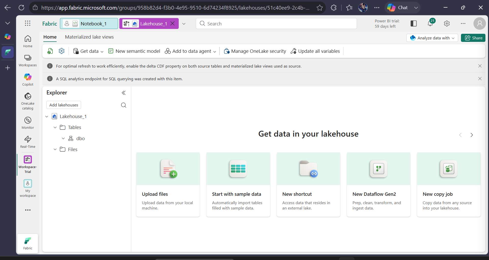
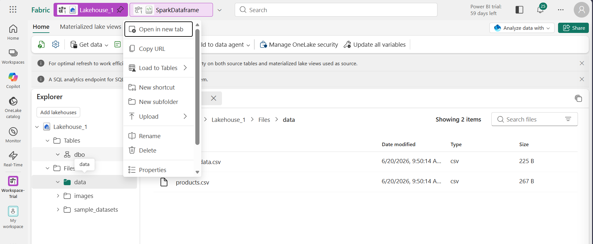

🏗️ Apache Spark Architecture
Driver Program → The “brain” of Spark. It defines the application logic and coordinates tasks.

Cluster Manager → Allocates resources across the cluster (examples: YARN, Kubernetes, or Spark’s built-in manager).

Executors → Worker processes running on cluster nodes. They execute tasks assigned by the driver and store data in memory.

Resilient Distributed Dataset (RDD) → Spark’s core data structure. It represents distributed collections of data across nodes, enabling parallel operations.

High-level APIs:

Spark SQL → Structured queries.

Spark Streaming → Real-time data streams.

MLlib → Machine learning.

GraphX → Graph analytics.

🏗️ Hadoop Architecture
HDFS (Hadoop Distributed File System) → Stores massive datasets across multiple machines with replication for fault tolerance.

MapReduce → Programming model for processing data in parallel.

Map phase → Splits input into key-value pairs.

Reduce phase → Aggregates results.

YARN (Yet Another Resource Negotiator) → Resource manager that schedules jobs across the cluster.

🔑 Key Difference
Hadoop MapReduce → Disk-based, batch-oriented. Each step writes intermediate results to disk.

Spark → In-memory, iterative, faster. Keeps data in RAM when possible, reducing disk I/O.

📂 Where to Store This
Since this is reference knowledge (not directly from the module), it fits better in your resources.md later.
But if you want to capture your doubts and answers about “architecture” right now, you can also add a section in qna.md like:

## Architecture Doubts
- Q: What is the architecture of Apache Spark?
- A: Driver, Cluster Manager, Executors, RDD, APIs (SQL, Streaming, MLlib, GraphX).
- Q: What is the architecture of Hadoop?
- A: HDFS, MapReduce, YARN.
- Q: Key difference?
- A: Spark = in-memory, faster. Hadoop = disk-based, slower

# OneLake Lakehouse Architecture

                ┌───────────────────────────────┐
                │          OneLake              │
                │  Unified Data Lake            │
                │  - Stores all data (raw +     │
                │    structured) in open formats│
                └───────────────────────────────┘
                           │
                           ▼
        ┌───────────────────────────────────────────┐
        │              Lakehouse Layer              │
        │  - Combines Data Lake + Data Warehouse    │
        │  - Supports SQL queries + ML workloads    │
        │  - Delta/Parquet files for performance    │
        └───────────────────────────────────────────┘
                           │
                           ▼
        ┌───────────────────────────────────────────┐
        │         Fabric Services Access            │
        │  - Spark Pools (PySpark, SQL)             │
        │  - Data Warehouse (T-SQL)                 │
        │  - Power BI (visualization)               │
        │  - Real-Time Analytics                    │
        └───────────────────────────────────────────┘

# Resources: Unit 2 - Apache Spark in Fabric

## Spark Pools
- Tip: Starter pool customization may be disabled at capacity level.
- Reference: [Manage Spark pools in Fabric]()

## Runtimes
- Tip: Multiple Spark runtimes supported; choose based on workload.
- Reference: [Apache Spark runtimes in Fabric](link)

## Environments
- Tip: Use environments to bundle runtimes + libraries.
- Reference: [Create and configure environments](link)

## Additional Config Options
- Native Execution Engine → Enable via environment config or notebook %%configure.
- High Concurrency Mode → Enable in workspace settings for shared sessions.
- MLFlow Logging → Automatic logging of ML experiments.
- Spark Administration → Manage Spark at capacity level (permissions, DR, surge protection).

## How to attach notebook to lakehouse in fabric
- **Method 1: Starting From Your Notebook (Most Common)**
    If you already have your notebook open and want to add a lakehouse to it:  
       1. Open your notebook in the Data Engineering experience.  
       2. Look at the left side panel. 
       3. You will see a section called Explorer.  
       4. Click the + Lakehouse button (it may just say Add or show a + icon).  
       5. A menu will pop up.  
       6. Choose Existing lakehouse (or New lakehouse if you need to build a fresh one).  
       7. Select your lakehouse from the list and click `Add`.  
- **Method 2: Starting From Your Lakehouse**
    If you are currently looking at your data inside a lakehouse and want to open it in a notebook:  
       1. Open your lakehouse from your workspace.  
       2. At the top navigation menu, click the Open notebook dropdown.  
       3. Click New notebook to start a fresh one, or Existing notebook to open one you already made.  
       4. The notebook will automatically open with that lakehouse already attached and ready to go!  

## How to upload a file to lakehouse
In your Lakehouse window click on `Upload A File`
  

You can even make folders as per your requirement by navigating to `Files` section
